# Classes?

Classes are the most important part of every selector.
They specify the elements that are to be styled.
This is why they are often used as synonym with the elements in question.

# Contents
* [`label_control`](#label_control)
* [`grid_layout_control`](#grid_layout_control)
* [`sheet_container_control`](#sheet_container_control)
* [`text_line_control`](#text_line_control)
* [`dropdown_button_control`](#dropdown_button_control)
* [`tool_tip_control`](#tool_tip_control)
* [`tool_tip_label_control`](#tool_tip_label_control)
* [`button_control`](#button_control)
* [`icon_button_control`](#icon_button_control)
* [`popup_control`](#popup_control)
* [`auto_complete`](#auto_complete)
* [`auto_complete_label`](#auto_complete_label)
* [`table_row`](#table_row)
* [`scroll_area_control`](#scroll_area_control)
* [`scroll_bar_control`](#scroll_bar_control)
* [`scroll_corner_control`](#scroll_corner_control)
* [`puck_control`](#puck_control)
* [`panel_control`](#panel_control)
* [`quick_panel`](#quick_panel)
* [`quick_panel_row`](#quick_panel_row)
* [`quick_panel_label`](#quick_panel_label)
* [`quick_panel_path_label`](#quick_panel_path_label)
* [`quick_panel_score_label`](#quick_panel_score_label)
* [`overlay_control`](#overlay_control)
* [`mini_quick_panel_row`](#mini_quick_panel_row)
* [`sidebar_container`](#sidebar_container)
* [`sidebar_tree`](#sidebar_tree)
* [`tree_row`](#tree_row)
* [`sidebar_heading`](#sidebar_heading)
* [`sidebar_label`](#sidebar_label)
* [`icon_folder`](#icon_folder)
* [`icon_file_type`](#icon_file_type)
* [`disclosure_button_control`](#disclosure_button_control)
* [`close_button`](#close_button)
* [`minimap_control`](#minimap_control)
* [`status_bar`](#status_bar)
* [`status_button`](#status_button)
* [`fold_button_control`](#fold_button_control)
* [`tabset_control`](#tabset_control)
* [`tab_control`](#tab_control)
* [`tab_label`](#tab_label)
* [`tab_close_button`](#tab_close_button)
* [`icon_regex`](#icon_regex)
* [`icon_case`](#icon_case)
* [`icon_highlight`](#icon_highlight)
* [`icon_in_selection`](#icon_in_selection)
* [`icon_reverse`](#icon_reverse)
* [`icon_whole_word`](#icon_whole_word)
* [`icon_wrap`](#icon_wrap)
* [`icon_preserve_case`](#icon_preserve_case)
* [`icon_context`](#icon_context)
* [`icon_use_buffer`](#icon_use_buffer)

<!-- #-#-#-#-#-#-#-#- -->

# `label_control`
Styles the text it contains. (Note that not all text is contained in `label_control` elements)

### Attributes
None known

### Customizations
* [`Textual`](customizations.md#textual)
	* [`color`](customizations.md#textual)
	* [`font.face`](customizations.md#textual)
	* [`font.size`](customizations.md#textual)
	* [`font.bold`](customizations.md#textual)
	* [`font.italic`](customizations.md#textual)
	* [`shadow_color`](customizations.md#textual)
	* [`shadow_offset`](customizations.md#textual)

### Affects
* Text in the [`status bar`](elements.md#status_bar)
	
* Text in the [`find dialogs`](elements.md#find_dialogs)
	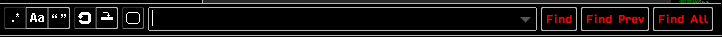
	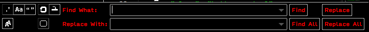
	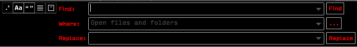

### Possible parents
* [`status_bar`](#status_bar)
* [`status_button`](#status_button)
* [`panel_control`](#panel_control)
* [`button_control`](#button_control)

### Possible children
None known

### See also
Other `*_label` classes:

* [`tool_tip_label_control`](#tool_tip_label_control)
* [`auto_complete_label`](#auto_complete_label)
* [`quick_panel_label`](#quick_panel_label)
* [`quick_panel_path_label`](#quick_panel_path_label)
* [`quick_panel_score_label`](#quick_panel_score_label)
* [`sidebar_label`](#sidebar_label)
* [`tab_label`](#tab_label)

<!-- #-#-#-#-#-#-#-#- -->

# `grid_layout_control`
Styles the view border in a multi-view layout.

### Attributes
None known

### Customizations
* [`border_width`](customizations.md#grid_layout_control)
* [`border_color`](customizations.md#grid_layout_control)

### Affects
* The border between the views in a multi-view layout
	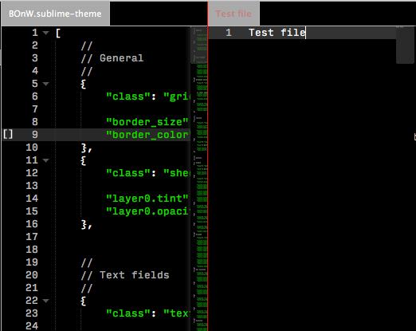

### Possible parents
None known

### Possible children
None known

### See also
`View -> Layout -> ...` menu option for enabling multi-view layouts.

<!-- #-#-#-#-#-#-#-#- -->

# `sheet_container_control`
Used to represent the background of an empty window. In new versions of ST it seems to be impossible to open an empty window.

<!-- #-#-#-#-#-#-#-#- -->

# `text_line_control`
Styles the text fields.

### Attributes
* [`hover`](attributes.md#hover)

### Customizations
* [`Container`](customizations.md#container)
	* [`layerN.texture`](customizations.md#container)
	* [`layerN.tint`](customizations.md#container)
	* [`layerN.opacity`](customizations.md#container)
	* [`layerN.draw_center`](customizations.md#container)
	* [`layerN.inner_margin`](customizations.md#container)
	* [`content_margin`](customizations.md#container)

### Affects
* Text field in the [`find dialogs`](elements.md#find_dialogs)
	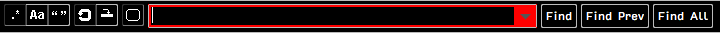
	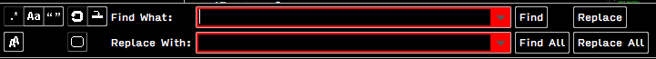
	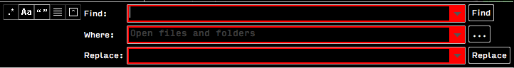
* Text field in the [`quick panel`](elements.md#quick_panel)
	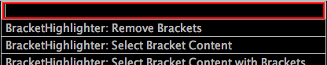
* Text field in the [`mini quick panel`](elements.md#mini_quick_panel)
	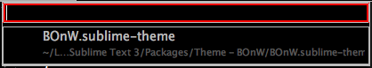
* Text field in the [`console`](elements.md#console)
	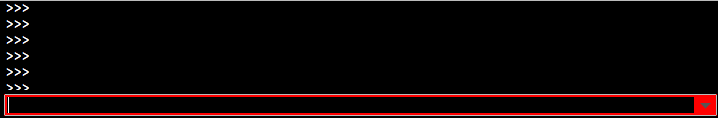

### Possible parents
* [`panel_control`](#panel_control)
* [`overlay_control`](#overlay_control)

### Possible children
* [`dropdown_button_control`](#dropdown_button_control)

### See also
To style the editing area of the text fields you have to use [`widgets`](basics.md#widgets)

<!-- #-#-#-#-#-#-#-#- -->

# `dropdown_button_control`
Controls the appearance of the dropdown button in text fields.

### Attributes
* [`hover`](attributes.md#hover)

### Customizations
* [`Container`](customizations.md#container)
	* [`layerN.texture`](customizations.md#container)
	* [`layerN.tint`](customizations.md#container)
	* [`layerN.opacity`](customizations.md#container)
	* [`layerN.draw_center`](customizations.md#container)
	* [`layerN.inner_margin`](customizations.md#container)
	* [`content_margin`](customizations.md#container)

### Affects
* Dropdown button in the [`find dialogs`](elements.md#find_dialogs)
	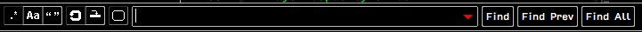
	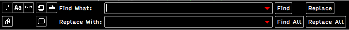
	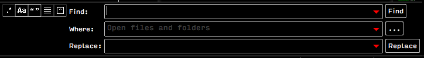
* Dropdown button in the [`console`](elements.md#console)
	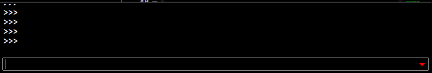

### Possible parents
* [`text_line_control`](#text_line_control)

### Possible children
None known

### See also
None

<!-- #-#-#-#-#-#-#-#- -->

# `tool_tip_control`
Styles the tooltips.

### Attributes
None known

### Customizations
* [`Container`](customizations.md#container)
	* [`layerN.texture`](customizations.md#container)
	* [`layerN.tint`](customizations.md#container)
	* [`layerN.opacity`](customizations.md#container)
	* [`layerN.draw_center`](customizations.md#container)
	* [`layerN.inner_margin`](customizations.md#container)
	* [`content_margin`](customizations.md#container)

### Affects
* Button tooltips **todo: list all the tooltipped buttons**
	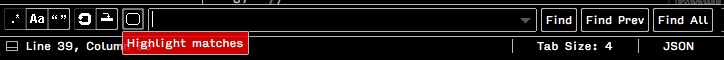
* Tooltip showing full path in tab list
	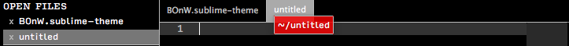

### Possible parents
None known

### Possible children
* [`tool_tip_label_control`](#tool_tip_label_control)

### See also
None

<!-- #-#-#-#-#-#-#-#- -->

# `tool_tip_label_control`
Styles the text it contains.

### Attributes
None known

### Customizations
* [`Textual`](customizations.md#textual)
	* [`color`](customizations.md#textual)
	* [`font.face`](customizations.md#textual)
	* [`font.size`](customizations.md#textual)
	* [`font.bold`](customizations.md#textual)
	* [`font.italic`](customizations.md#textual)
	* [`shadow_color`](customizations.md#textual)
	* [`shadow_offset`](customizations.md#textual)

### Affects
* Text in button tooltips **todo: list all the tooltipped buttons**
* Text in tooltips showing full path in tab list **todo: add picture**

### Possible parents
* [`tool_tip_control`](#tool_tip_control)

### Possible children
None known

### See also
None

<!-- #-#-#-#-#-#-#-#- -->

# `button_control`
Styles buttons that don't have icons.

### Attributes
* [`hover`](attributes.md#hover)
* [`pressed`](attributes.md#button_control)

### Customizations
* [`Container`](customizations.md#container)
	* [`layerN.texture`](customizations.md#container)
	* [`layerN.tint`](customizations.md#container)
	* [`layerN.opacity`](customizations.md#container)
	* [`layerN.draw_center`](customizations.md#container)
	* [`layerN.inner_margin`](customizations.md#container)
	* [`content_margin`](customizations.md#container)

### Affects
* Buttons in the [`find dialogs`](elements.md#find_dialogs)
	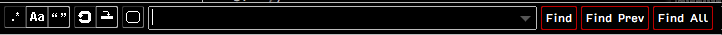
	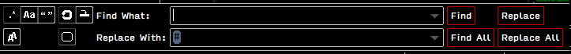
	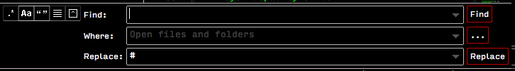

### Possible parents
* [`panel_control`](#panel_control)

### Possible children
* [`label_control`](#label_control)

### See also
None

<!-- #-#-#-#-#-#-#-#- -->

# `icon_button_control`
Styles buttons that have icons.

### Attributes
* [`hover`](attributes.md#hover)
* [`left`](attributes.md#icon_button_control)
* [`right`](attributes.md#icon_button_control)
* [`selected`](attributes.md#icon_button_control)

Note: `left` and `right` attributes are combined to style buttons with no neighbors.
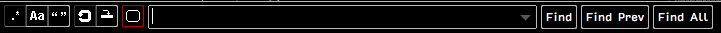
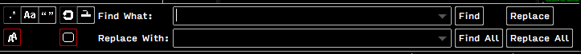

### Customizations
* [`Container`](customizations.md#container)
	* [`layerN.texture`](customizations.md#container)
	* [`layerN.tint`](customizations.md#container)
	* [`layerN.opacity`](customizations.md#container)
	* [`layerN.draw_center`](customizations.md#container)
	* [`layerN.inner_margin`](customizations.md#container)
	* [`content_margin`](customizations.md#container)

### Affects
* Buttons in the [`find dialogs`](elements.md#find_dialogs)

### Possible parents
* [`panel_control`](#panel_control)

### Possible children
None known

### See also
Classes styling the actual icons:

* [`icon_regex`](#icon_regex)
* [`icon_case`](#icon_case)
* [`icon_highlight`](#icon_highlight)
* [`icon_in_selection`](#icon_in_selection)
* [`icon_reverse`](#icon_reverse)
* [`icon_whole_word`](#icon_whole_word)
* [`icon_wrap`](#icon_wrap)
* [`icon_preserve_case`](#icon_preserve_case)
* [`icon_context`](#icon_context)
* [`icon_use_buffer`](#icon_use_buffer)

<!-- #-#-#-#-#-#-#-#- -->

# `popup_control`
Styles the autocomplete.
Overlayed by [`auto_complete`](#auto_complete)

### Attributes
None known

### Customizations
* [`Container`](customizations.md#container)
	* [`layerN.texture`](customizations.md#container)
	* [`layerN.tint`](customizations.md#container)
	* [`layerN.opacity`](customizations.md#container)
	* [`layerN.draw_center`](customizations.md#container)
	* [`layerN.inner_margin`](customizations.md#container)
	* [`content_margin`](customizations.md#container)

### Affects
* Autocomplete
	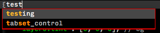

### Possible parents
None known

### Possible children
* [`auto_complete`](#auto_complete)
* [`auto_complete_label`](#auto_complete_label)
* [`table_row`](#table_row)

### See also
None

<!-- #-#-#-#-#-#-#-#- -->

# `auto_complete`
Style the autocomplete.
Overlayed by [`table_row`](#table_row)

### Attributes
None known

### Customizations
* [`Container`](customizations.md#container)
	* [`layerN.texture`](customizations.md#container)
	* [`layerN.tint`](customizations.md#container)
	* [`layerN.opacity`](customizations.md#container)
	* [`layerN.draw_center`](customizations.md#container)
	* [`layerN.inner_margin`](customizations.md#container)
	* [`content_margin`](customizations.md#container)
* [`row_padding`](customizations.md#row_padding)
* [`dark_content`](customizations.md#dark_content)

### Affects
* Autocomplete
	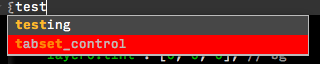

### Possible parents
* [`popup_control`](#popup_control)

### Possible children
* [`auto_complete_label`](#auto_complete_label)
* [`table_row`](#table_row)

### See also
None

<!-- #-#-#-#-#-#-#-#- -->

# `auto_complete_label`

### Attributes
None known

### Customizations
* [`fg`](customizations.md#auto_complete_label)
* [`bg`](customizations.md#auto_complete_label)
* [`selected_fg`](customizations.md#auto_complete_label)
* [`selected_bg`](customizations.md#auto_complete_label)
* [`match_fg`](customizations.md#auto_complete_label)
* [`match_bg`](customizations.md#auto_complete_label)
* [`selected_match_fg`](customizations.md#auto_complete_label)
* [`selected_match_bg`](customizations.md#auto_complete_label)

### Affects
* Autocomplete text
	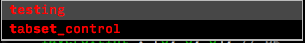

### Possible parents
* [`popup_control`](#popup_control)
* [`auto_complete`](#auto_complete)
* [`table_row`](#table_row)

### Possible children
None known

### See also
None

<!-- #-#-#-#-#-#-#-#- -->

# `table_row`

### Attributes

### Customizations

### Affects

### Possible parents

### Possible children

### See also

<!-- #-#-#-#-#-#-#-#- -->

# `scroll_area_control`

### Attributes

### Customizations

### Affects

### Possible parents

### Possible children

### See also

<!-- #-#-#-#-#-#-#-#- -->

# `scroll_bar_control`

### Attributes

### Customizations

### Affects

### Possible parents

### Possible children

### See also

<!-- #-#-#-#-#-#-#-#- -->

# `scroll_corner_control`

### Attributes

### Customizations

### Affects

### Possible parents

### Possible children

### See also

<!-- #-#-#-#-#-#-#-#- -->

# `puck_control`

### Attributes

### Customizations

### Affects

### Possible parents

### Possible children

### See also

<!-- #-#-#-#-#-#-#-#- -->

# `panel_control`

### Attributes

### Customizations

### Affects

### Possible parents

### Possible children

### See also

<!-- #-#-#-#-#-#-#-#- -->

# `quick_panel`

### Attributes

### Customizations

### Affects

### Possible parents

### Possible children

### See also

<!-- #-#-#-#-#-#-#-#- -->

# `quick_panel_row`

### Attributes

### Customizations

### Affects

### Possible parents

### Possible children

### See also

<!-- #-#-#-#-#-#-#-#- -->

# `quick_panel_label`

### Attributes

### Customizations

### Affects

### Possible parents

### Possible children

### See also

<!-- #-#-#-#-#-#-#-#- -->

# `quick_panel_path_label`

### Attributes

### Customizations

### Affects

### Possible parents

### Possible children

### See also

<!-- #-#-#-#-#-#-#-#- -->

# `quick_panel_score_label`

### Attributes

### Customizations

### Affects

### Possible parents

### Possible children

### See also

<!-- #-#-#-#-#-#-#-#- -->

# `overlay_control`

### Attributes

### Customizations

### Affects

### Possible parents

### Possible children

### See also

<!-- #-#-#-#-#-#-#-#- -->

# `mini_quick_panel_row`

### Attributes

### Customizations

### Affects

### Possible parents

### Possible children

### See also

<!-- #-#-#-#-#-#-#-#- -->

# `sidebar_container`

### Attributes

### Customizations

### Affects

### Possible parents

### Possible children

### See also

<!-- #-#-#-#-#-#-#-#- -->

# `sidebar_tree`

### Attributes

### Customizations

### Affects

### Possible parents

### Possible children

### See also

<!-- #-#-#-#-#-#-#-#- -->

# `tree_row`

### Attributes

### Customizations

### Affects

### Possible parents

### Possible children

### See also

<!-- #-#-#-#-#-#-#-#- -->

# `sidebar_heading`

### Attributes

### Customizations

### Affects

### Possible parents

### Possible children

### See also

<!-- #-#-#-#-#-#-#-#- -->

# `sidebar_label`

### Attributes

### Customizations

### Affects

### Possible parents

### Possible children

### See also

<!-- #-#-#-#-#-#-#-#- -->

# `icon_folder`

### Attributes

### Customizations

### Affects

### Possible parents

### Possible children

### See also

<!-- #-#-#-#-#-#-#-#- -->

# `icon_file_type`

### Attributes

### Customizations

### Affects

### Possible parents

### Possible children

### See also

<!-- #-#-#-#-#-#-#-#- -->

# `disclosure_button_control`

### Attributes

### Customizations

### Affects

### Possible parents

### Possible children

### See also

<!-- #-#-#-#-#-#-#-#- -->

# `close_button`

### Attributes

### Customizations

### Affects

### Possible parents

### Possible children

### See also

<!-- #-#-#-#-#-#-#-#- -->

# `minimap_control`

### Attributes

### Customizations

### Affects

### Possible parents

### Possible children

### See also

<!-- #-#-#-#-#-#-#-#- -->

# `status_bar`

### Attributes

### Customizations

### Affects

### Possible parents

### Possible children

### See also

<!-- #-#-#-#-#-#-#-#- -->

# `status_button`

### Attributes

### Customizations

### Affects

### Possible parents

### Possible children

### See also

<!-- #-#-#-#-#-#-#-#- -->

# `fold_button_control`

### Attributes

### Customizations

### Affects

### Possible parents

### Possible children

### See also

<!-- #-#-#-#-#-#-#-#- -->

# `tabset_control`

### Attributes

### Customizations

### Affects

### Possible parents

### Possible children

### See also

<!-- #-#-#-#-#-#-#-#- -->

# `tab_control`

### Attributes

### Customizations

### Affects

### Possible parents

### Possible children

### See also

<!-- #-#-#-#-#-#-#-#- -->

# `tab_label`

### Attributes

### Customizations

### Affects

### Possible parents

### Possible children

### See also

<!-- #-#-#-#-#-#-#-#- -->

# `tab_close_button`

### Attributes

### Customizations

### Affects

### Possible parents

### Possible children

### See also

<!-- #-#-#-#-#-#-#-#- -->

# `icon_regex`

### Attributes

### Customizations

### Affects

### Possible parents

### Possible children

### See also

<!-- #-#-#-#-#-#-#-#- -->

# `icon_case`

### Attributes

### Customizations

### Affects

### Possible parents

### Possible children

### See also

<!-- #-#-#-#-#-#-#-#- -->

# `icon_highlight`

### Attributes

### Customizations

### Affects

### Possible parents

### Possible children

### See also

<!-- #-#-#-#-#-#-#-#- -->

# `icon_in_selection`

### Attributes

### Customizations

### Affects

### Possible parents

### Possible children

### See also

<!-- #-#-#-#-#-#-#-#- -->

# `icon_reverse`

### Attributes

### Customizations

### Affects

### Possible parents

### Possible children

### See also

<!-- #-#-#-#-#-#-#-#- -->

# `icon_whole_word`

### Attributes

### Customizations

### Affects

### Possible parents

### Possible children

### See also

<!-- #-#-#-#-#-#-#-#- -->

# `icon_wrap`

### Attributes

### Customizations

### Affects

### Possible parents

### Possible children

### See also

<!-- #-#-#-#-#-#-#-#- -->

# `icon_preserve_case`

### Attributes

### Customizations

### Affects

### Possible parents

### Possible children

### See also

<!-- #-#-#-#-#-#-#-#- -->

# `icon_context`

### Attributes

### Customizations

### Affects

### Possible parents

### Possible children

### See also

<!-- #-#-#-#-#-#-#-#- -->

# `icon_use_buffer`

### Attributes

### Customizations

### Affects

### Possible parents

### Possible children

### See also

<!-- #-#-#-#-#-#-#-#- -->

Class                     | Affected elements                                 | Customizations                                                                                                     | Attributes                                    | See also
------------------------- | ------------------------------------------------- | ------------------------------------------------------------------------------------------------------------------ | --------------------------------------------- | --------
label_control             | Button                                            | `group: text`                                                                                                      | none                                          | none
grid_layout_control       | Layout border                                     | `border_size`, `border_color`                                                                                      | none                                          | none
sheet_container_control   | **todo: add**                                     | `group: container`                                                                                                 | none                                          | none
text_line_control         | Group: panels                                     | `group: container`                                                                                                 | none                                          | [`Widgets` at `basics.md`](basics.md#widgets)
dropdown_button_control   | Drop down button                                  | `group: container`                                                                                                 | `hover`                                       | none
tool_tip_control          | Tooltip                                           | `group: container`                                                                                                 | none                                          | none
tool_tip_label_control    | Tooltip                                           | `group: text`                                                                                                      | none                                          | none
button_control            | Button                                            | `group: container`                                                                                                 | `hover`, `pressed`                            | none
icon_button_control       | Icon button                                       | `group: container`                                                                                                 | `left`, `right`, `selected`, `hover`          | Classes starting with `icon_`
popup_control             | Autocomplete                                      | `group: container`                                                                                                 | none                                          | none
auto_complete             | Autocomplete                                      | `group: container`, `row_padding`, `dark_content`                                                                  | none                                          | none
auto_complete_label       | Autocomplete                                      | `group: fgbg`                                                                                                      | none                                          | none
table_row                 | Autocomplete                                      | `group: container`                                                                                                 | `selected`                                    | none
scroll_area_control       | Scroll bar *(indirectly)*                         | `overlay`                                                                                                          | none                                          | Preference `overlay_scroll_bars`
scroll_bar_control        | Scroll bar                                        | `group: container`, `blur`                                                                                         | `horizontal`                                  | Preference `overlay_scroll_bars`
scroll_corner_control     | Scroll bar                                        | `group: container`, `blur`                                                                                         | `horizontal`                                  | Preference `overlay_scroll_bars`
puck_control              | Scroll bar                                        | `group: container`, `blur`                                                                                         | `horizontal`                                  | Preference `overlay_scroll_bars`
panel_control             | Group: panels                                     | `group: container`                                                                                                 | none                                          | none
quick_panel               | Quick panel, Mini quick panel                     | `group: container`, `row_padding`, `dark_content`                                                                  | none                                          | none
quick_panel_row           | Quick panel                                       | `group: container`                                                                                                 | `selected`                                    | none
quick_panel_label         | Quick panel, Mini quick panel                     | `group: fgbg`                                                                                                      | none                                          | none
quick_panel_path_label    | Quick panel                                       | `group: fgbg`                                                                                                      | none                                          | none
quick_panel_score_label   | Quick panel                                       | `group: fgbg`                                                                                                      | none                                          | none
overlay_control           | Mini quick panel                                  | `group: container`                                                                                                 | none                                          | none
mini_quick_panel_row      | Mini quick panel                                  | `group: container`                                                                                                 | `selected`                                    | none
sidebar_container         | Sidebar                                           | `group: container`                                                                                                 | none                                          | none
sidebar_tree              | Sidebar                                           | `group: container`, `indent`, `indent_offset`, `indent_top_level`, `dark_content`                                  | none                                          | none
tree_row                  | Sidebar                                           | `group: container`                                                                                                 | `selected`, `hover`, `expandable`, `expanded` | none
sidebar_heading           | Sidebar                                           | `group: text`                                                                                                      | none                                          | none
sidebar_label             | Sidebar                                           | `group: text`                                                                                                      | none                                          | Preference `bold_folder_labels`
icon_folder               | Sidebar                                           | `group: container`                                                                                                 | none                                          | none
icon_file_type            | Sidebar                                           | `group: container`                                                                                                 | none                                          | `File sidebar icons` at `basics.md`
disclosure_button_control | Sidebar                                           | `group: container`                                                                                                 | none                                          | none
close_button              | Sidebar                                           | `group: container`                                                                                                 | none                                          | none
minimap_control           | Minimap                                           | `viewport_color`, `viewport_opacity`                                                                               | `hover`                                       | Preference `always_show_minimap_viewport`
status_bar                | Status bar                                        | `group: container`                                                                                                 | none                                          | none
status_button             | Status bar                                        | `group: container`                                                                                                 | none                                          | none
fold_button_control       | Fold buttons                                      | `group: container`                                                                                                 | `expanded`, `hover`                           | none
tabset_control            | Tabs                                              | `group: container`, `group: tint`, `tab_overlap`, `tab_width`, `tab_min_width`, `tab_height`, `mouse_wheel_switch` | `group: fileColors`                           | Preference `mouse_wheel_switches_tabs`
tab_control               | Tabs                                              | `group: container`, `group: tint`, `max_margin_trim`, `hit_test_level`                                             | `selected`, `group: fileColors`, `dirty`      | Preference `highlight_modified_tabs`
tab_label                 | Tabs                                              | `group: fgbg`, `fade`                                                                                              | `selected`, `group: fileColors`               | none
tab_close_button          | Tabs                                              | `group: container`                                                                                                 | `selected`, `hover`, `dirty`                  | Preference `show_tab_close_buttons`
icon_regex                | Find dialog, Find in files dialog, Replace dialog | `group: container`                                                                                                 | none                                          | none
icon_case                 | Find dialog, Find in files dialog, Replace dialog | `group: container`                                                                                                 | none                                          | none
icon_highlight            | Find dialog, Replace dialog                       | `group: container`                                                                                                 | none                                          | none
icon_in_selection         | Find dialog, Replace dialog                       | `group: container`                                                                                                 | none                                          | none
icon_reverse              | **todo: add**                                     | `group: container`                                                                                                 | none                                          | none
icon_whole_word           | Find dialog, Find in files dialog, Replace dialog | `group: container`                                                                                                 | none                                          | none
icon_wrap                 | Find dialog, Replace dialog                       | `group: container`                                                                                                 | none                                          | none
icon_preserve_case        | Replace dialog                                    | `group: container`                                                                                                 | none                                          | none
icon_context              | Find in files dialog                              | `group: container`                                                                                                 | none                                          | none
icon_use_buffer           | Find in files dialog                              | `group: container`                                                                                                 | none                                          | none
